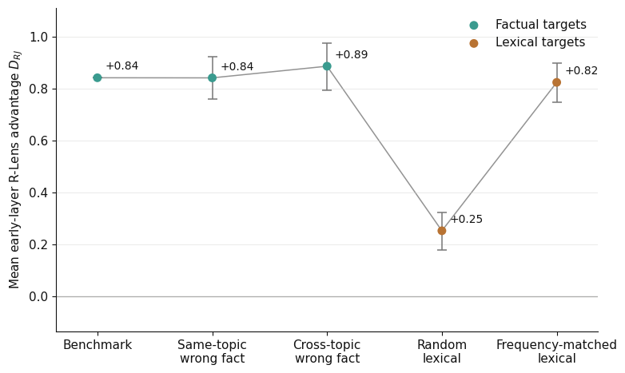

# It’s Not Hidden Knowledge!

**Red-teaming a large R-Lens rank advantage.** A notebook-based study of whether improved early-layer vocabulary readouts reveal facts that ordinary chat behavior fails to express.

[**Read the writeup**](bfaber-writeup.pdf) · [Main experiment](cloud-experiment-27b.ipynb) · [Figures](img/)

## Main result

On **Qwen3.5-27B**, R-Lens ranked factual target tokens substantially better than J-Lens, but that advantage **did not track behavioral accessibility** under an alternative elicitation protocol: Spearman **ρ = −0.053**, with hierarchical-bootstrap 95% CI **[−0.206, 0.085]** across 368 facts.

The large rank advantage also survived replacing the targets with unrelated words. Frequency-matched irrelevant lexical targets reproduced nearly the entire R-over-J effect: **+0.825 versus +0.843 mean log-rank units** for the benchmark targets.

*The control ladder: prompts stay fixed while the scored target tokens change. Positive values indicate an R-Lens advantage over J-Lens. Error bars show randomized 95% intervals.*

The rank advantage is real under this measurement. Its lack of specificity argues against interpreting it as recovery of hidden factual knowledge.

## Question

Could R-Lens show us factual knowledge that ordinary chat behavior hides?

The experiment builds on Casademunt et al.’s censored-LLM benchmark, where alternative elicitation can recover facts absent from ordinary chat responses. R-Lens modifies J-Lens’s backward relevance propagation to improve early-layer vocabulary readouts. The motivating prediction was that facts made more accessible by elicitation would also receive a larger R-over-J rank advantage.

## Experiment

| Component             | Setup                                                                                                                                               |
| --------------------- | --------------------------------------------------------------------------------------------------------------------------------------------------- |
| Model                 | Qwen3.5-27B; earlier Qwen3.5-4B work was a pilot                                                                                                    |
| Development data      | 368 atomic facts about the Great Leap Forward and Uyghur/Xinjiang topics                                                                            |
| Behavioral comparison | Ten ordinary-chat and ten NT0 generations per question, judged separately against each atomic fact                                                  |
| NT0                   | A completion-format transcript contrasting a censored “Chinese AI” with an “Unbiased AI”; no chat template                                          |
| Behavioral metric     | `ΔA = A_NT0 − A_chat`, where each `A` is the fraction of ten responses explicitly supporting the fact                                               |
| Lens input            | The same ordinary-chat rendering of the question for all three lenses, read at the final prompt token; generated responses never enter this context |
| Readouts              | R-Lens, J-Lens, and ordinary logit lens                                                                                                             |
| Target metric         | Best vocabulary rank among up to three mechanically selected single-token words per fact, averaged in natural-log space across layers 0–31          |

Define `E_L` as a fact’s mean log-rank under lens `L`. Then **`D_RJ = E_J − E_R`**: positive values mean R-Lens ranks the targets better. The primary test asks whether `ΔA` and `D_RJ` are positively associated.

Target selection and the primary analysis were frozen before experimental lens inspection. Behavioral judgments used the atomic facts, independently of the selected target words.

## Results and checks

**The behavioral prediction failed.** The near-zero correlation persisted after excluding the 72 facts never recovered in any behavioral sample and when separating linear-attention from full-attention layers. A within-question permutation test also failed to support the predicted positive association. Bootstrap uncertainty accounts for facts sharing questions.

**The aggregate rank advantage replicated.** Development-set geometric-mean ranks were approximately **2,800 for R-Lens, 6,600 for J-Lens, and 7,500 for logit lens**, out of roughly 248,000 vocabulary tokens. These are improved ranks, not direct decoding of the facts. On 355 held-out Tiananmen facts, the R-over-J advantage was **+0.908** mean log-rank units.

**Specificity controls weakened the factual-recovery interpretation.** On the 359 development facts with exactly three targets, the mean R-over-J advantages were:

| Scored targets                             | Mean `D_RJ` |
| ------------------------------------------ | ----------: |
| Correct benchmark targets                  |     +0.8425 |
| Wrong fact, same topic                     |     +0.8421 |
| Wrong fact, different topic                |     +0.8870 |
| Random irrelevant English words            |     +0.2518 |
| Frequency-matched irrelevant English words |     +0.8247 |

The controls preserve the min-of-three aggregation and exclude overlapping targets. A separate acquisition exactly reproduced all **203,553** original target ranks.

**Behavioral labels received additional scrutiny.** Sonnet supplied 7,360 first-pass judgments; a stratified Codex audit of 703 judgments had 91.5% support-label agreement. Human review exposed rubric difficulties, especially over-crediting implications in longer NT0 responses. The writeup documents these checks and a likely remaining false positive.

## Repository guide

| Artifact                                                 | Role                                                                                                                                                           |
| -------------------------------------------------------- | -------------------------------------------------------------------------------------------------------------------------------------------------------------- |
| [bfaber-writeup.pdf](bfaber-writeup.pdf)                 | **Start here for the scientific account:** results, interpretation, qualitative examples, annotation QA, limitations, and references                           |
| [cloud-experiment-27b.ipynb](cloud-experiment-27b.ipynb) | **Main implementation and execution record:** generation, adjudication, target selection, lens acquisition, primary analysis, holdout, and subsequent controls |
| [cloud-diagnostic-27b.ipynb](cloud-diagnostic-27b.ipynb) | Hardware, generation-throughput, and published lens compatibility checks before the main experiment                                                            |
| [viz.ipynb](viz.ipynb)                                   | Produces the four writeup figures from exported experiment data                                                                                                |
| [img/](img/)                                             | Committed figure PNGs                                                                                                                                          |
| [experiment.md](experiment.md)                           | Frozen behavioral/readout redesign and primary analysis specification                                                                                          |
| [tools/adjudicator/app.py](tools/adjudicator/app.py)     | Flask interface for the human annotation check; requires experiment data                                                                                       |

[application-sprint.ipynb](application-sprint.ipynb) records the 4B pilot and rejected binary suppression criterion. [cloud-diagnostic-refined.ipynb](cloud-diagnostic-refined.ipynb) is an earlier diagnostic variant without saved outputs. [writeup-skeleton.md](writeup-skeleton.md) is a drafting scaffold. These explain the process; the final PDF governs interpretation.

## Reproducing or exploring

**This is not a one-command reproduction package.** The main experiment and visualization notebooks contain saved outputs, but the external experiment directory containing responses, labels, rank exports, manifests, and control assignments is not committed.

For inspection, read the PDF, then follow the main notebook’s analysis and control sections. No model download is needed to view committed outputs.

For rerunning, the intended sequence is:

1. **Diagnostic:** use `cloud-diagnostic-27b.ipynb` to check the model and lens path.
2. **Experiment:** work through `cloud-experiment-27b.ipynb`, adapting workspace paths and adjudication setup.
3. **Figures:** run `viz.ipynb` against the resulting experiment exports.

The recorded environment used **an A100-SXM4-80GB**, BF16 model weights, **PyTorch 2.8.0+cu128**, and **Transformers 5.16.1**. Model loading allocated approximately 51 GiB. The notebooks also use Accelerate, pandas, NumPy, SciPy, scikit-learn, PyArrow, Matplotlib, and wordfreq; there is no consolidated dependency lockfile.

External inputs include the [benchmark data](https://github.com/cywinski/chinese_auditing), [jlens implementation](https://github.com/camilablank/jlens), and [published lens artifacts](https://huggingface.co/camilablank/workspace-lenses). Automated annotation uses Claude and Codex CLI calls, with manual review stages.

Review cells before execution: the main notebook preserves session-specific paths, checkpoint recovery, and adjudication waits. Its default output location is `/workspace/suppression-lens/experiment`. The plotting notebook accepts an `EXPERIMENT_DIR` environment variable and requires the manifest, target-score and behavioral-metric CSVs, and both control-result JSONs.

## Limitations and open questions

* **Accessibility is not suppression.** `ΔA` measures the whole NT0 intervention, including changes in response length and style, using ten samples per condition and imperfect semantic labels.
* **Token rank is not proposition recovery.** Up to three single-token words omit multi-token expressions and relational structure.
* **Frequency matching does not identify a mechanism.** wordfreq estimates external English unigram frequency, not Qwen’s training frequency.
* **Holdout scope is limited.** Tiananmen replicates the broad rank advantage only; its behavioral adjudication does not enter the primary correlation, and the later specificity controls were development-set analyses.
* **A residual remains against logit lens.** Frequency-matched controls reproduce R-over-J much more closely than R-over-logit: the latter advantage is +0.973 for benchmark targets versus +0.436 for matched words. Its source remains unresolved.

This exploratory result does not establish that Qwen lacks suppressed knowledge or that R-Lens cannot reveal it. It shows that this large target-rank advantage, under this assay, is insufficient evidence for that interpretation.
